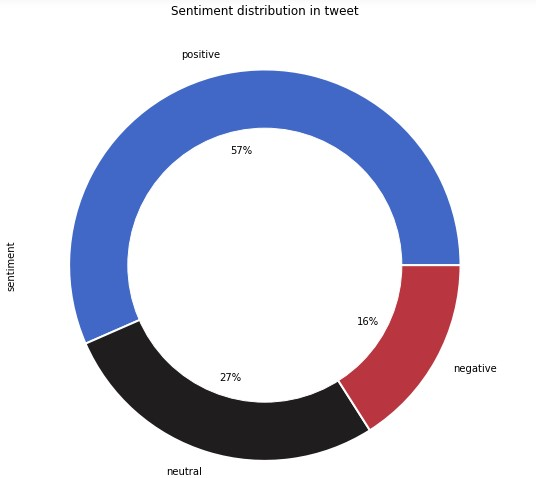
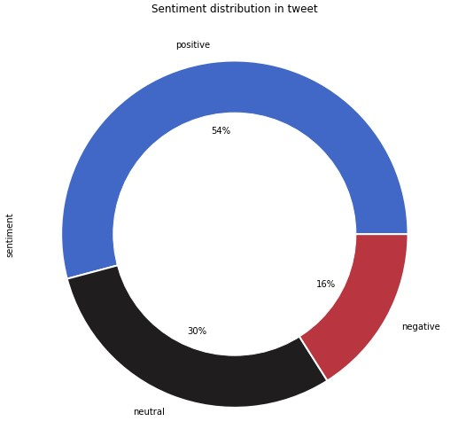
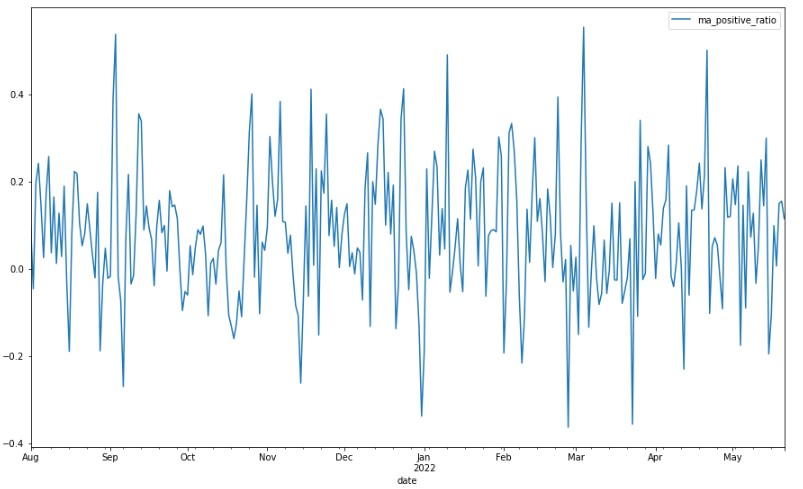
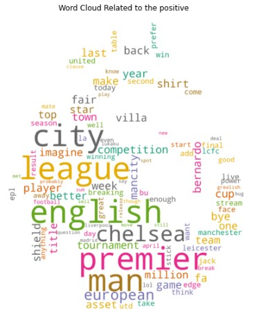
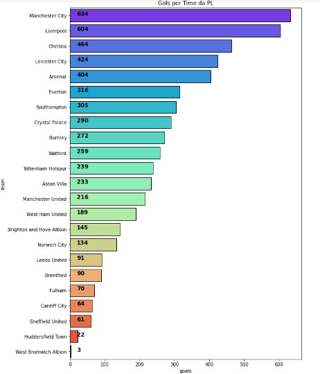
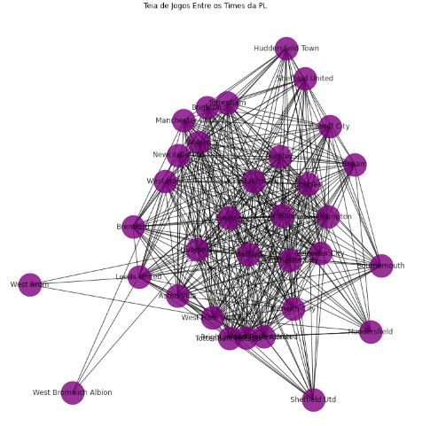
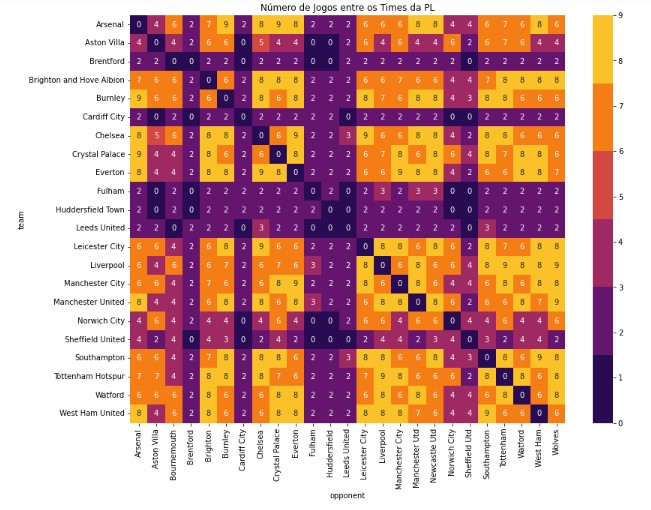
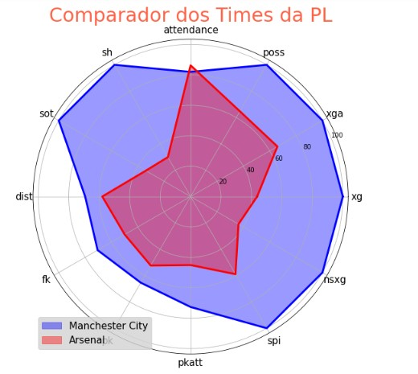

# Forecasting Model of Premier League Matches Results

## General Objective
A repository for publishing our python discipline project, where we build a forecasting model of Premier League Matches Results using Python programing language.

## Databases
Our datas come from three sources:
   1. For the tweets related to PL teams, we use the Twitter module of snscrape, a library for scraping into social medias;
   2. For matches informations, we collect de datas from [FBREF](https://fbref.com/en/) site, using a common request method;
   3. And, to collect SPI and NSXG indexes, we resort to the scraping technique that makes use of the web driver to access the information present in sites built in java script language. The referred web site is [FiveThirtyEight](https://fivethirtyeight.com/).

At the end of this step, we storege our dataframes in csv files and professionally into SQL server.
## Data Cleaning
For data manipulation, our main librarys was `pandas` and `numpy`, where we adapted the databases for visualization and estimation purposes.

## Data Visualization
In this step the main librarys used were `matplotlib.pyplot` and `seaborn`. Below we present the respectives visualizations generated:

## Model
To train and test our model, we use the Random Forest Classifier method, loaded from sklearn library. As our best result, we get a 67.90% of accuracy level.